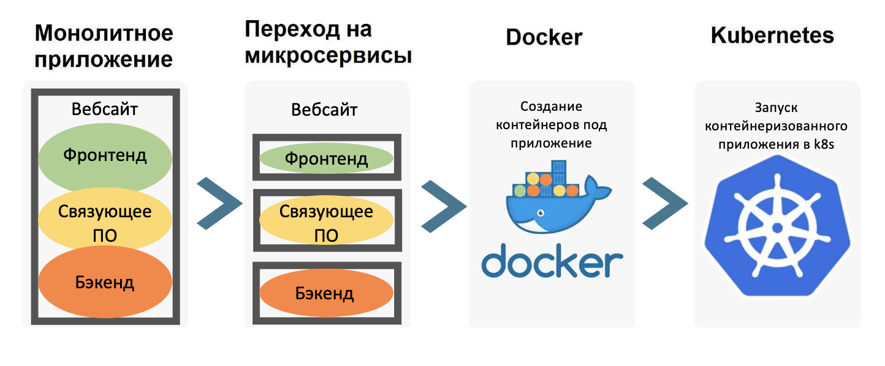
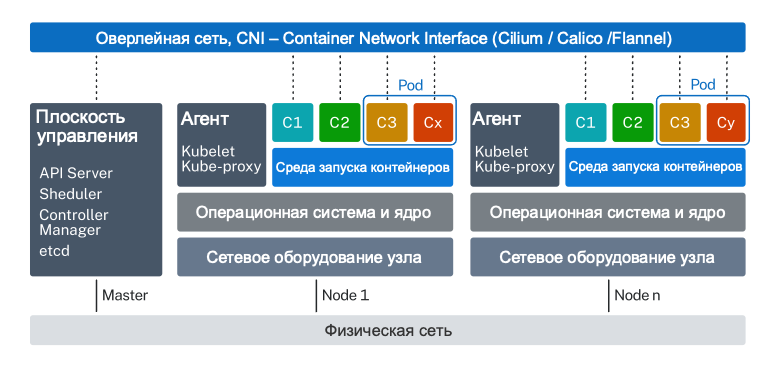
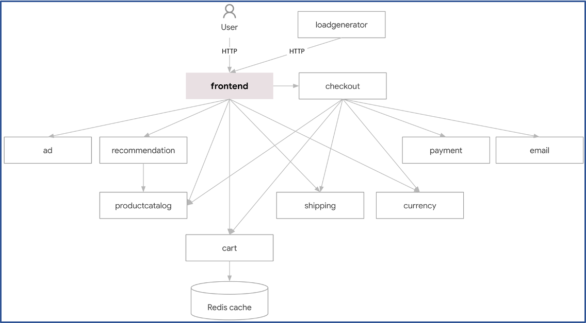
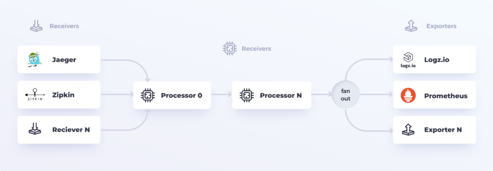
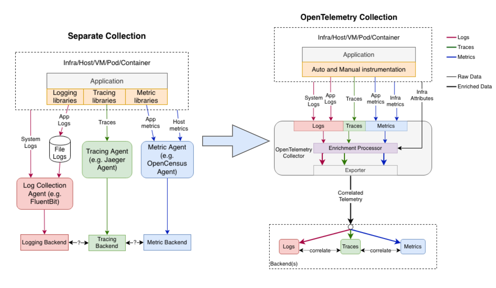
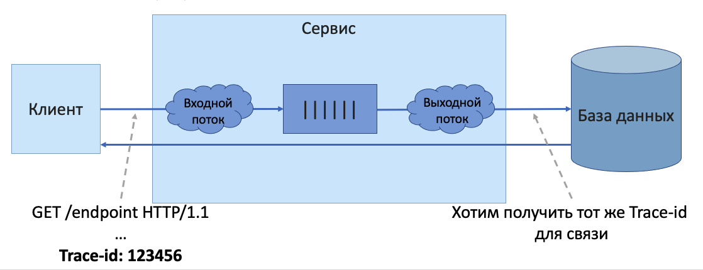
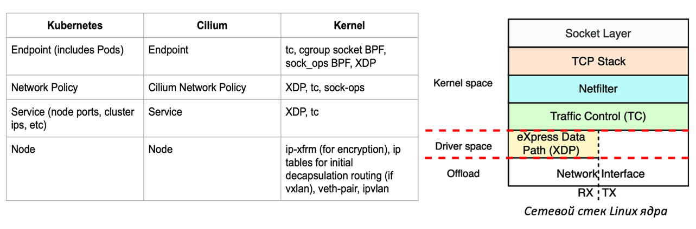
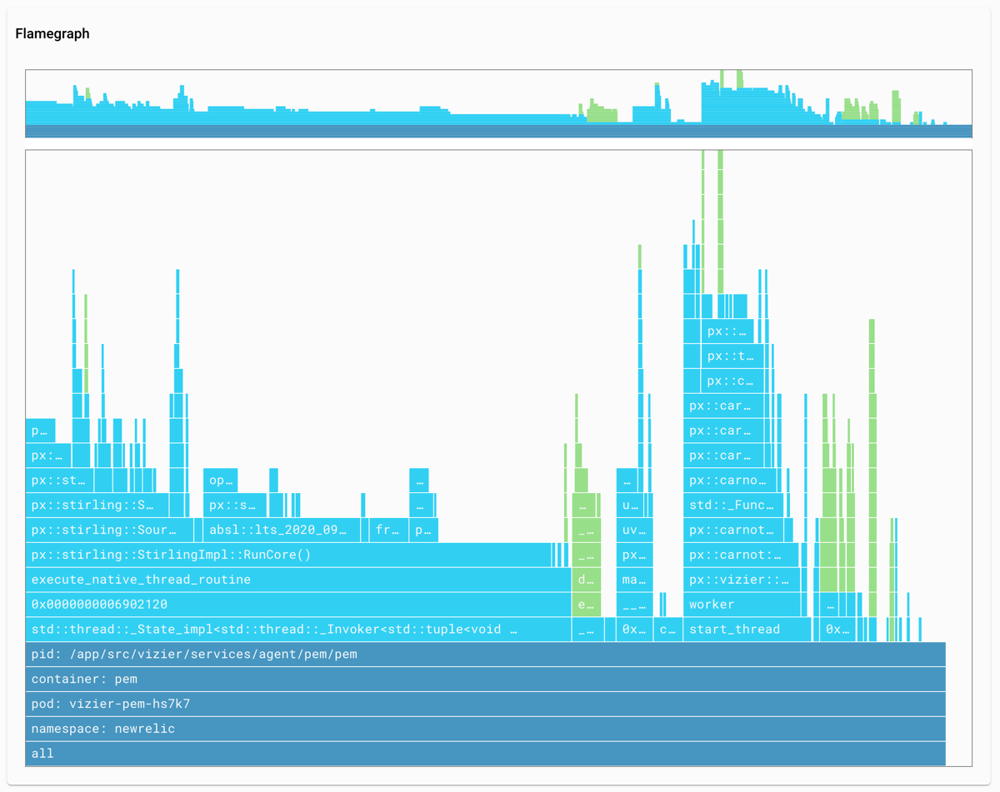
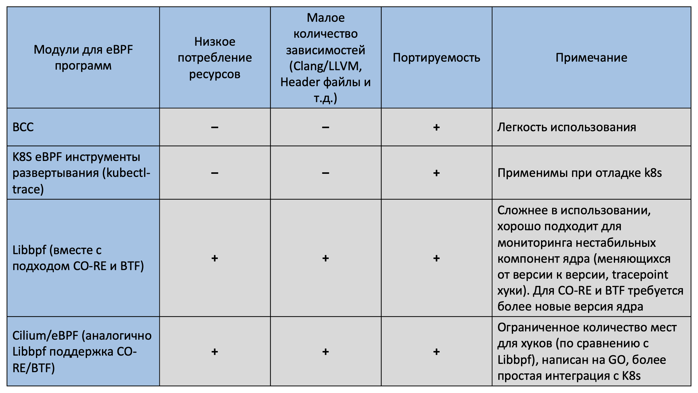
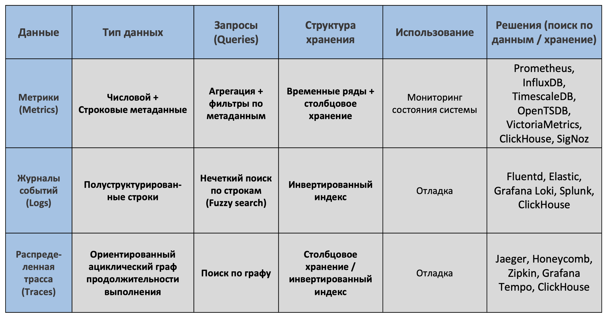

# Наблюдаемость сетевой инфраструктуры Kubernetes. Часть первая.

<Наблюдаемость сделать с большой буквы везде>
<разбавить наблюдаемость на Observability>

В этой статье будут рассмотрены инструменты наблюдения за сетевой
инфраструктурой Kubernetes (k8s) и основные составляющие наблюдаемости
– мониторинг, журналы событий, метрики, трассировка и оповещение. Обсудим, как эти
инструменты могут помочь обеспечить надежную и эффективную работу
кластеров Kubernetes и запущенных на них микросервисах, а также какие
преимущества и недостатки существуют при использовании этих
решений.

Эта статья для DevOps, Kubernetes administrators и SRE инженеров,
которым важно и интересно разобраться в том, как устроена сетевая
инфраструктура Kubernetes, какое взаимодействие происходит на уровне
ядра Linux и различных приложений (Go, Java, Python и т.п.), разобраться
в двух обширных технология **eBPF** и **OpenTelemetry** активно
продвигаемых CNCF сообществом. А главное при помощи каких инструментов
можно упростить принятие решений инженерам при использовании Kubernetes в своих
проектах и продуктах.

Статья будет разбита на три части, в связи с большим количеством
информации. Первая часть посвящена обзору подходов для наблюдения за
инфраструктурой Kubernetes. Во второй части будут разобраны инструменты,
базирующиеся на eBPF. В третьей части инструменты, использующие
OpenTelemetry.

## Содержание
  - [Введение](#введение)
  - [Обзор сетевой инфраструктуры Kubernetes](#обзор-сетевой-инфраструктуры-kubernetes)
    - [Пример микросервисной архитектуры в Kubernetes](#пример-микросервисной-архитектуры-в-kubernetes)
  - [eBPF и OpenTelemetry](#ebpf-и-opentelemetry)
    - [Подробнее о eBPF](#подробнее-о-ebpf)
      - [Применимость eBPF в Kubernetes](#применимость-ebpf-в-kubernetes)
    - [Подробнее об OpenTelemetry](#подробнее-об-opentelemetry)
      - [Эволюция архитектуры инструментирования приложений](#эволюция-архитектуры-инструментирования-приложений)
      - [Применимость такого подхода в Kubernetes](#применимость-такого-подхода-в-kubernetes)
  - [Существующие подходы к мониторингу и наблюдаемости в Kubernetes](#существующие-подходы-к-мониторингу-и-наблюдаемости-в-kubernetes)
    - [Распределенная трассировка](#распределенная-трассировка)
    - [Service Meshes](#service-meshes)
    - [Системы мониторинга на основе eBPF](#системы-мониторинга-на-основе-ebpf)
  - [Классы инструментов наблюдения за сетевой инфраструктуры Kubernetes](#классы-инструментов-наблюдения-за-сетевой-инфраструктуры-kubernetes)
  - [Заключение](#заключение)

## Введение

Современные масштабируемые приложения строятся на распределенных
системах, использующих облачную инфраструктуру (cloud-native,
serverless) и микросервисные программные архитектуры. К сожалению,
принося много преимуществ компаниям, внедряющим их, эти системы также
усложняют <процессы обеспечения стабильного функционирования программных продуктов и отладки
возникающих проблем>.

*Рисунок 1. Эволюция разработки приложений*

<существенную ценность приобретают иснтурменты которые позволят инженерным командам понять и устранить проблемы и улучшить . ПОЭТМУ ТАКОЙ ТЕРМИН КАК НАБЛЮДАЕМОСТЬ НАЧИНАЕТ ЗВУЧАТ Подругому . Поэтмтому возникает новый класс инстурментов наблюдаемости. И позволяет находить <вопросы через двоеточие: -- / -- x> "что послужило причиной?" / "Как сделать так чтобы этой проблема больше не возникала?" возниконвения проблем/неполадок и решить их в дальнейшем >

**Инструменты наблюдаемости** становятся основным решением для
устранения этих сложностей и помогают инженерным командам получить столь
необходимый централизованный обзор распределенных систем. Такой термин,
как **Наблюдаемость** (на англ. Observability), позволяет понять систему
извне – задавать вопросы о ней, не зная ее внутреннего устройства.
Более того, инструменты наблюдаемости позволяют легко устранять
неполадки и решать возникающие проблемы, а также помогают ответить на
вопросы \"Почему это происходит\" и "Кто виноват в случившемся)".

## Обзор сетевой инфраструктуры Kubernetes

<добавить ссылку на контейнеры что это такое>

Kubernetes - это система контейнерной (а в расширенном случае и
виртуальных машин) оркестрации, цель которой - обеспечить ~надежную и
последовательную~ <автоматизацию последовательных задач, выстроить процессы связанные с автоматизацией, повторяемость> автоматизацию таких задач, как развертывание,
масштабирование и обновление контейнерных сред. Системы
Kubernetes, называемые кластерами (cluster), обычно работают на
нескольких потенциально разнородных хост-машинах (hosts, термин из
ЦОДа), называемых узлами (Nodes). Под (pod, абстрактный объект
Kubernetes, представляющий собой «обертку» для одного или группы
контейнеров) - это атомарный блок, которым управляет Kubernetes.
Типичная конструкция кластера: он содержит несколько подов, которые в
свою очередь запущенны на узлах. Каждый pod изолирован от хост-машины с
помощью пространств имен и cgroups. Контейнеры в одном и том же pod не
изолированы друг от друга и используют общие пространства имен.

> ☝️ Контейнеры, выполняющие вспомогательные функции по отношению к основному контейнеру в pod, называются sidecars.

*Схема 1. Инфраструктура Kubernetes*

Kubernetes не имеет строго закрепленной реализации сетевой
инфраструктуры – существует лишь [небольшой набор правил для однозначной
идентификации подов](https://kubernetes.io/docs/concepts/services-networking/). Вместо
этого k8s реализуе <организация сетей в k8s достигается через использование сетевых плагинов> сетевым плагинам реализовывать свои собственные
настраиваемые сети.

Существует две основные категории сетевых плагинов: kubenet, CNI. 
1) Первая категория: плагин
**Kubenet** (старое название, в документации он уже присутствует под
названием
[noop](https://kubernetes.io/docs/concepts/extend-kubernetes/compute-storage-net/network-plugins),
который распространяется вместе с Kubernetes и предоставляет минимальный
набор функций для функционирования кластера Kubernetes. 
2) Вторая категория: сетевые плагины, реализующие спецификацию Container
Network Interface (CNI), называемые **CNI плагины**: Flannel, Weave,
Calico, Cilium, Istio и др. <CNI плагины могут реализовывать сетевую
модель с помощью совершенно разных подходов (шифрование трафика между подами, ...)>. kubernetes (k8s) можно настроить с одновременных использованием нескольких CNI плагинов –  Flannel + Calico, либо
Cilium + CNI для BGP протокола <ссылка>.

Инфраструктура Kubernetes также включает в себя сервисы
(Services) и сетевые политики (Policies), которые позволяют приложениям
взаимодействовать друг с другом внутри кластера:

1) **Services** Kubernetes обеспечивают постоянный IP-адрес и DNS-имя для
набора подов, которые выполняют определенную функцию или предоставляют
доступ к конкретному приложению. Сервисы могут быть созданы для любого
набора подов, даже если они находятся на разных узлах кластера или в
разных пространствах имен. Сервисы Kubernetes также обеспечивают
балансировку нагрузки между подами, что позволяет распределять сетевой трафик
между несколькими экземплярами приложения.

2) **Network Policies** Kubernetes позволяют управлять трафиком внутри
кластера, определяя правила доступа к сервисам и подам. Например,
сетевая политика может быть создана для разрешения доступа только из
определенного пространства имен или для определенных IP-адресов.
Политики также могут использоваться для настройки маршрутизации,
например, для перенаправления трафика на другие сервисы или кластеры.

*Рисунок 2. Пример использования service и network policy. Трафик от внешних 
клиентов идёт только на сервис web, а сервис web общается с двумя другими 
сервисами foo и bar. Причем другие методы общения между сервисами запрещены 
при помощи сетевых политик.*
<мониторинг , ... в инфре kubernetes могут стать головной болью из-за разных подходов при выборе CNI >
Из-за больших различий в реализациях CNI и свободе выбора при настройке
инфраструктуры – мониторинг, вопросы безопасности и устранение
неполадок сетевой инфраструктуры Kubernetes могут стать настоящей
головной болью. Чем более сложное архитектурное взаимодействие между сервисами и
компонентами k8s пытается настроить инженер, тем более вероятно
возникновение проблем, таких как блокировки сетевого трафика или
неожиданные <синоним непредвиденный> ~задержки при работе приложений~. А отказ от использования сетевых
политик и шифрования трафика поставит под угрозу безопасность
разрабатываемого продукта.

Если вы хотите получить подробную информации о компонентах инфраструктуры Kubernetes, можете ознакомиться со <поменять на новую ссылку где больше про сети> [справочником Kubernetes](https://kubernetes.io/docs/concepts/overview/components/#networking-components) 
или использовать команду `kubectl explain <resource>`, например,
`kubectl explain service`.

> 💡 Уже на этапе поднятия CNI для k8s можно наблюдать за функционированием 
инфраструктурой при помощи встроенных инструментов Kubernetes 
(Kubernetes Dashboard, kubectl, или получать информацию через  
[Kubernetes API](https://kubernetes.io/docs/reference/command-line-tools-reference/kube-apiserver/)) 
либо при помощи инструментов, имеющихся в CNI плагинах 
([Calico observability tools](https://github.com/tigera-solutions/calicocloud-aks-workshop/blob/main/modules/using-observability-tools.md), 
[Cilium Hubble](https://github.com/cilium/hubble#features) и т.д.).

### Пример микросервисной архитектуры в Kubernetes

За основу для тестов и экспериментов в данной статье было выбрано
следующее [демо](https://github.com/GoogleCloudPlatform/microservices-demo#readme)
(14 тыс. звёзд и 5 тыс. форков):

*Рисунок 3. Онлайн магазин товаров. В зависимости от версии, которую вы 
форкнете из репозитория, будут отличаться продаваемые товары (но это не 
должно вас смутить, так как архитектура взаимодействия сервисов остается 
той же).*

Данное приложение состоит из 11 микросервисов, написанных на разных
языках (go, c#, JavaScript, Python, Java\...), которые [общаются друг с
другом через
gRPC](https://github.com/GoogleCloudPlatform/microservices-demo#architecture):

*Схема 2. Архитектура приложения*

<отедльно в два предложения и перенсти ebpf и otel к словам "два проекта/">

Далее рассмотрим два проекта/"технологии", без которых невозможно
дальнейшее обсуждение Наблюдаемости Kubernetes (либо нам придётся резко
ограничить себя в выборе инструментов и соответственно информации,
которую можно получить из Kubernetes) – это **eBPF** и
**OpenTelemetry** ([подробный разбор с CNCF NA 2022 про возможности двух
технологий, рассказывает разработчик продукта New Relic Pixie, о котором
вскоре будет тоже рассказано](https://youtu.be/0D4GTdv7QQA)).

## eBPF и OpenTelemetry

**eBPF** (enhanced Berkeley Packet Filter) - это функкционал ядра Linux,
которая позволяет создавать и встраивать на уровне ядра программы, которые могут
мониторить и контролировать различные события в системе. В Kubernetes
eBPF может быть использован для мониторинга сетевого трафика между
подами, анализа производительности приложений и обнаружения утечек
ресурсов. <може также повтор> eBPF может также использоваться для создания пользовательских
метрик и трассировки запросов в приложениях.

Для того, чтобы показать насколько eBPF стал популярен, стоит
продемонстрировать количество проектов использующих его:

*Рисунок 4. Сюда не вошли многие крупные проекты, которые также начинают 
адаптировать свои решения под eBPF (например, Istio). С полным списком 
можно ознакомиться на официальном сайте eBPF 
 https://ebpf.io/applications/.*

**OpenTelemetry (OTel)** - это набор инструментов и библиотек для сбора,
анализа и экспорта метрик, трасс и журналов из приложений и
инфраструктуры. OpenTelemetry может быть использован для
мониторинга Kubernetes, включая мониторинг производительности,
отслеживания запросов и обнаружения ошибок (в случае, если агент на
нодах будет выдавать ему эту информацию). OTel поддерживает несколько
языков программирования, включая Java, Python, Go, Ruby и другие, что
делает его универсальным решением для сбора телеметрии из
различных приложений и систем.

<добавить предложение описыающее картинку снизу как вводное>

*Рисунок 5. OpenTelemetry состоит из трёх основных компонент – формата 
данных, SDK для инструментирования приложений и коллектора для сбора, 
хранения и передачи данных. Связующим звеном является OTLP – 
OpenTelemetry Protocol.*

Обе технологии - eBPF и OpenTelemetry - имеют большой потенциал для
улучшения Kubernetes Observabiity и способны точнее и быстрее диагностировать и
устранять проблемы в микросервисной архитектуре.

*Таблица 1. Сценарии использования eBPF и OpenTelemetry для наблюдаемости k8s.*

### Подробнее о eBPF

**Berkeley Packet Filter** (классический BPF) - это технология <функционал либо поменять на другое> ядра
Unix, которая была представлена в 1992 году и позволяла программам
пользовательского пространства выполнять код в определенных точках
сетевого стека (рисунок 2). Основное назначение технологии заключалось в
том, чтобы обеспечить настраиваемую stateless фильтрацию пакетов
(работает быстрее statefull при интенсивном трафике) без накладных
расходов, связанных с копированием пакетов в пользовательское
пространство. Классический BPF широко использовался в таких
инструментах, как tcpdump.

> 🔦 Если вы запустите tcpdump с фильтром (определенный хост или порт), он компилируется в оптимальный байткод BPF, 
> который выполняется встроенной виртуальной машиной в ядре.

Разработка **extended Berkeley Packet Filter** (eBPF, расширенного BPF)
в 2014 году открыла множество новых вариантов использования, особенно в
серверных и микросервисных средах. Добавление новых точек подключения в
ядре и в пространстве пользователя теперь позволяет контролировать или
изменять поведение компонентов всей системы. Были введены постоянные
структуры данных ядра, доступные как в пользовательском пространстве,
так и в программах eBPF – **eBPF maps**, что позволило создавать
программы eBPF с возможностью изменения состояний программ. Также на
эволюцию eBPF повлияло увеличения числа регистров и увеличения размера
регистров до 64 бит, введения соглашения о вызове с нулевыми накладными
расходами и увеличения максимального размера стека. Хотя eBPF не
является Тьюринг полным (из-за ограничений, накладываемых проверкой
программы verifier'ом), его можно использовать для широкого спектра
задач (рисунок 6). Развитие eBPF все еще продолжается: в новых версиях
ядра доступны дополнительные точки перехвата, типы для eBPF maps и др.

*Рисунок 6. Инструменты, сопоставленные с различными разделами ядра и 
уровня приложений Linux на примере библиотек BCC/BPF для eBPF.*

Программы eBPF могут быть запущены в различных \"хуках\" (hooks) ядра,
таких как входящие пакеты, исходящие пакеты, системные вызовы.

-   **XDP** – Express Data Path, позволяет запускать программы BPF из
    сетевого драйвера;
-   **kprobes** – kernel probes, динамический доступ к внутренним
    компонентам ядра;
-   **tracepoints** – статический доступ к внутренним компонентам
    ядра;
-   **uprobes** – user-space probes, динамический доступ к программам,
    работающим в пространстве пользователя;
-   **USDT** – **User statically defined tracepoints**, статический
    доступ к программам, запущенным в пространстве пользователя;
-   и другие.

*Рисунок 7. При помощи каких хуков какую область сетевого стека можно покрыть при помощи eBPF.*

Другое определение более точно описывающее текущие возможности eBPF –
это виртуальная машина, которая запускает программы из пространства
пользователя и прикрепляет их к заданной точке ядра/пользовательского
пространства/драйвера устройства для наблюдения за различными событиями.

*Рисунок 8. Пример инструментирования сокетов (вместо трёх точек можно 
написать обработчик пакета, а при помощи флага TC_ACT_OK отправить его 
дальше по сетевому стеку).*

#### Применимость eBPF в Kubernetes

Архитектура приложений в Kubernetes отличается от традиционных серверных
приложений, для которых изначально разрабатывалось ядро Linux. Поэтому
существует широкий спектр функциональных возможностей Kubernetes,
которые можно упростить, сделать более производительными или иным
образом улучшить, изменив поведение ядра. Однако, добавление нового
функционала в ядро может быть трудоемким процессом, требующим много
времени. eBPF позволяет быстро реализовывать новые инструменты (за счёт
различных хуков), которые направлены на инфраструктуру Kubernetes и не
могут быть включены в основное ядро без разработки собственных версий
ядра или модулей ядра. Также программы eBPF могут быть использованы для
создания функциональности ядра, которая будет лучше поддерживать
приложения в контейнерных средах.

Как пример, Cilium выбрали решение для CNI, где маршрутизация строится
за счёт eBPF (другое решение CNI Calico также начало поддерживать eBPF
маршрутизацию). Этот выбор позволил им заметно ускорить сетевое
взаимодействие сервисов в Kubernetes ([в сравнении с
iptables](https://cilium.io/blog/2021/05/11/cni-benchmark/)).

А на графике 1 сравнивается насколько сильно увеличивается задержка
запросов и ответов при мониторинге HTTP протокола при помощи парсера на
основе eBPF (коричневый столбец, Cilium eBPF + Envoy) и при
использовании sidecar контейнера работающего, как HTTP прокси (синий
столбец, Istio service mesh + Envoy). Где Envoy – это прокси для
парсинга протоколов на уровне приложений, таких как HTTP, Kafka, gRPC и
DNS.

*График 1. Бенчмарк HTTP-запроса/ответа, измеряющий задержку P95, при 
использовании мониторинга HTTP протокола. Здесь сравнивается влияние на 
задержку при работе парсера HTTP/2 на основе eBPF (коричневый цвет), 
подхода sidecar (синий цвет), по сравнению с базовым решением без прокси 
(желтый цвет), в которой не включена видимость.*

### Подробнее об OpenTelemetry

**OpenTelemetry (Otel)** – это стандарт распределенной трассировки и
мониторинга. Otel в первую очередь ориентирован на сбор данных, а не на
хранение или обработку запросов.

Основные типы обираемых данных при использовании OpenTelemetry:

-   **Traces** – контекст того, что произошло.
-   **Resources** – контекст, где произошла проблема.
-   **Metrics** – прикрепленный к трассам данные.
-   **Logs** – прикрепленные к трассам события.

**OpenTelemetry Collector**

OpenTelemetry Collector может собирать данные из OpenTelemetry SDK и
других источников, а затем экспортировать эту телеметрию в любой
поддерживаемый бэкэнд, такой как Jaeger, Prometheus или очереди Kafka.
OTel Collector может служить как локальным агентом, расположенным на
одном узле с приложением, так и центральным сервисом в распределенной
системе, агрегирующим данные с нескольких узлов приложения.

*Рисунок 9. Архитектура OpenTelemetry Collector*

OpenTelemetry Collector построен как конвейер, состоящей из четырех
основных частей:

-   **Receivers** для приема входящих данных различных форматов и
    протоколов, таких как OTLP, Jaeger и Zipkin. Список доступных
    приемников можно найти
    [здесь](https://github.com/open-telemetry/opentelemetry-collector-contrib/tree/main/receiver).
-   **Processors** для выполнения агрегации данных, фильтрации, выборки
    и другой логики коллекторной обработки телеметрических данных.
    Процессоры можно объединять в цепочки для создания сложной логики
    обработки.
-   **Exporters** для передачи телеметрических данных в один или
    несколько конечных пунктов назначения (обычно инструменты анализа
    или агрегаторы более высокого порядка) в различных форматах и
    протоколах, таких как OTLP, Prometheus и Jaeger. Список доступных
    экспортеров можно найти
    [здесь](https://github.com/open-telemetry/opentelemetry-collector-contrib/tree/main/exporter).
-   **Connectors** для соединения различных конвейеров в одном
    коллекторе. Коннектор служит как экспортером, так и приемником,
    поэтому он может потреблять данные как экспортер из одного конвейера
    и передавать их как приемник в другой конвейер. Например, [Span
    Metrics
    Connector](https://horovits.medium.com/from-distributed-tracing-to-apm-taking-opentelemetry-and-jaeger-up-a-level-12dfe85022da)
    может агрегировать метрики из Span'ов.

**OpenTelemetry protocol (OTLP)** – единый, связный поток данных,
содержащий **ресурсы**, **трассы**, **метрики**, **журналы**,
**профилирование** и многое другое. За счёт наличия такого протокола
можно, например, проводить простую миграцию с одного backend решения на
другое (главное, чтобы другой инструмент поддерживал OTLP). OTLP
работает в связке либо с gRPC, либо с HTTP. Для сериализации
структурированных данных испольузется ProtoBuf ([Protobuf
payloads](https://opentelemetry.io/docs/specs/otlp/#binary-protobuf-encoding)).

Приступая к оценке OpenTelemetry для своего проекта, вы должны сначала
узнать свой стек, а затем сопоставить его с соответствующими
компонентами для вашей системы. Начните с этих трех основных вопросов:

-   *Какие языки программирования и фреймворки?* Например, Java и Spring
    для бэкенда и NodeJS и Express для фронтенда будут хорошим началом.
    Это определит клиентские библиотеки, которые вы будете использовать,
    и, возможно, агентов для инструментирования фреймворков
    ([источник](https://opentelemetry.io/docs/instrumentation/)).
-   *Какие типы сигналов и протоколы? Собираете ли вы журналы
    событий/метрики/трассу? Они поступают из вашего приложения через SDK
    или из других источников, таких как Kafka, Docker или MySQL?* Это
    определят **Receivers**, которые вы будете использовать в вашем
    OpenTelemetry Collector.
-   *Какие аналитические инструменты в бэкенде? Отправляете ли вы данные
    трассировки в Jaeger? Отправляете ли вы метрики в Prometheus? Или,
    возможно, в кластер Kafka для последующей постановки в очередь?* За
    это отвечают **Exporters**.

*Таблица 2. Поддерживаемые OTel языки программирования и  фреймворки*

#### Эволюция архитектуры инструментирования приложений

*Рисунок 10. Эволюция архитектуры инструментирования приложений*

В традиционной архитектуре журналы, трассы и метрики генерируются и
собираются отдельно. С OpenTelemetry все данные будут собираться
OpenTelemetry Collector и передаваться на единый бэкэнд для объединения.
Преимущества при таком подходе:

-   Приложение может реализовать наблюдаемость через **OTel SDK**, с
    меньшим количеством зависимостей и меньшим потреблением ресурсов.
-   Требуется только один коллектор, что снижает затраты на
    развертывание и эксплуатацию.
-   Формат данных унифицирован, что упрощает корреляцию данных.

На предыдущем рисунке показана конечная цель. Однако, по оценкам
сообщества, в ближайшие один-два года все равно потребуются другие
коллекторы журналов событий, поскольку OpenTelemetry Collector в
настоящее время не обеспечивает достаточно надежную поддержку Log'ов.

Распределенная трассировка ввела понятие распространения контекста
трассировки через метки **TraceId** и **SpanId**.

Однако, по сути, ничто не мешает для журналов событий принять те же
концепции распространения контекста. Если бы записанные журналы
содержали идентификаторы контекста трассировки
(**TraceId/SpanId/Resources** или другие определяемые пользователями
метки), это привело бы к гораздо более богатой корреляции между
журналами и трассировками, а также к корреляции между журналами,
собираемыми из различных компонент распределенной системы. Это сделает
журналы событий значительно более ценными в распределенных системах.

Это одно из перспективных направлений развития инструментов
наблюдаемости. Стандартизация корреляции журналов с трассировками и
метриками; добавление поддержки распространения распределенного
контекста для журналов; унификация атрибутов журналов, трассировок и
метрик повысит индивидуальную и совокупную ценность информации о
наблюдаемости для старых и современных систем (напоминает подход Datadog
со своими связующими тэгами для разных типов даннных).

#### Применимость такого подхода в Kubernetes

Например, OpenTelemetry Collector может добавить ко всем телеметрическим
данным, поступающим от Kubernetes Pod, несколько атрибутов, которые
описывают pod, и это может быть сделано автоматически с помощью
[k8sprocessor](https://pkg.go.dev/github.com/open-telemetry/opentelemetry-collector-contrib/processor/k8sprocessor)
без необходимости для приложения делать что-либо специальное. Самое
главное, что такое обогащение полностью одинаково для всех трех типов
данных. Коллектор гарантирует, что журналы, трассы и метрики имеют точно
такие же имена и значения атрибутов, описывающих k8s pod, из которого
они получены.

## Существующие подходы к мониторингу и наблюдаемости в Kubernetes

Существует множество подходов к мониторингу кластеров Kubernetes. Далее
проведем обзор нескольких общих подходов и их пригодность для различных
сценариев.

### Распределенная трассировка

**Распределенная трассировка** - это подход к инструментированию
сервисов для профилирования (сбора характеристик программы во время её
выполнения) и мониторинга приложений на базе микросервисов. Подобно
трассировке в традиционных сетях, целью распределенной трассировки
является создание и сбор низкоуровневой информации о выполнении
программы так, чтобы запросы и ответы конкретного микросервисного
приложения можно было отслеживать на протяжении всего времени их жизни в
программе. Эта информация может быть использована для мониторинга
работоспособности и производительности приложения а также во время
процесса отладки. Например, распределенная трассировка может
использоваться для выявления сервисов, которые действуют как узкие
места, предлагая разработчикам оптимизировать или увеличить масштаб
развертывания.

*Рисунок 11. Схема наблюдения за приложением в поде с использованием распределенной трассы.*

В кластерной конфигурации на основе микросервисов задача разработки
инфраструктуры, необходимой для отслеживания запроса по его зависимостям
от множества различных сервисов, может оказаться сложной. API и
инструменты, такие как OpenTelemetry и Jaeger, позволяют легче создавать
и анализировать распределенные трассировки в кластерах Kubernetes.

Базовый пример сбора распределенной трассы на основе микросервисной
архитектуры магазина товаров: 
1\. Клиент начинает взаимодействие с интерфейсом приложения.

*Рисунок 12. Один из примеров, как может выглядеть открытый клиентом интерфейс приложения.*

2\. Инфраструктура приложения должна уметь распространять
контекст/метаданные (уникальный идентификатор запроса и характеристики,
которые хотим пронаблюдать) между микросервисами, чтобы собирать всю
информацию о конкретной трассе исходящей от пользователя.

*Рисунок 13. Как выглядит распространение контекста в разрезе архитектуры приложения*

3\. Формируется распределенная трасса приложения, при помощи которой
можно проследить сколько каждый микросервис (в терминах распределенной
трассы  – spans, на рисунке 12 это прямоугольники) занял по времени от
общей продолжительности запроса пользователя, зашедшего на сервис, до
момента когда весь интерфейс появился у него в Web UI. К тому же в
каждом из таких spans, можно переносить метрики (иногда логи) или просто
метку процесса, по который можно связать информацию, выдаваемую при
помощи других инструментов по наблюдаемости.

*Рисунок 14. Полученная распределенная трасса одного запроса от пользователя.*

Распределенную трассу можно получить использую различные API и
инструменты, такие как OpenTelemetry, Jaeger, Elastic, Odigos (проект на
основе OpenTelemetry и eBPF).

Основным недостатком подхода распределенной трассировки является то, что
он не всегда может быть динамически инструментирован, часто часть
функционала того же OpenTelemetry можно внедрить только после написания
дополнительного кода под конкретный микросервис. Поэтому добавление
распределенной трассировки в существующие микросервисные приложения
может быть длительным и трудоемким процессом. В тех случаях, когда
невозможно инструментировать код, например, в закрытых бинарных файлах
сторонних разработчиков, можно анализировать входящие и исходящие
запросы микросервиса. Однако такой подход уже будет близок к
инструментированию при помощи eBPF (анализ входа/выхода при помощи
uprobes) и не сможет обеспечить такой же уровень детализации, если
система является открытой для инструментирования.

Важно отметить, что решения для полного сбора распределенной трассы,
основанного на eBPF, на данный момент нет, из-за того, что
распространение контекста/метаданных требует, во-первых, статического
интструментирования кода при помощи USDT eBPF хуков (User
Statically-Defined Tracing probes) без какой либо автоматики. А,
во-вторых, надо прикреплять Trace-id в заголовок сообщений между
микросервисами, причём при прохождении "конвейера" функций одного из
сервисов эта информация должна сохраняться.

*Рисунок 15. Сложность передачи метаданных при помощи eBPF.*

### Service Meshes

Service Mesh – это отдельный инфраструктурный уровень, который мы
добавляем к приложениям для взаимодействия между сервисами или
микросервисами.

*Рисунок 16. Схема наблюдения за K8s подом с использованием service 
mesh. Sidecar внедряет сетевые прокси между рабочими нагрузками в 
кластере для сбора сетевых данных.*

В него входит широкая категория инструментов Kubernetes, которые обычно
направлены на управление нагрузкой, маршрутизацию трафика, обеспечение
безопасности и наблюдаемость. Однако, у Service Mesh есть некоторые
недостатки, например, этот подход требует изменения инфраструктуры k8s
(а не только предоставляющий наблюдаемость, как распределенная
трассировка) к тому же обладающий меньшей производительность по
сравнению Cilium (график 1). Кроме того, Service Meshes требуют
дополнительных ресурсов и увеличивают сложность управления приложениями.
Поэтому, прежде чем принимать решение о реализации Service Mesh в
собственной системе, необходимо тщательно изучить его возможности и
ограничения. Подробнее остановимся на двух: Linkerd и Istio.

Linkerd развивался как высоко производительный Service Mesh, но
ограниченный по набору функций в сравнении с другими инструментами.
Использует специализированный прокси linkerd2-proxy, который не
позволяет пользователям создавать собственные метрики, но предоставляет
набор функций мониторинга по умолчанию:

1\. Метрики на уровне приложений (объемы запросов, коды ответов HTTP или
gRPC и показатели успешности)

2\. Метрики транспортного уровня (количество открытых или закрытых
TCP-соединений, общее количество байт, отправленных или полученных по
TCP, и продолжительность времени, в течение которого TCP-соединения были
открыты)

3\. Метрики для протоколов – общее количество запросов либо ответов и
данные по задержке.

4\. Маркировка рабочей нагрузки (k8s workload) запущенных приложений в
k8s. Предыдущие метрики из пунктов 1-3 маркируются связанными с ними
рабочими нагрузками Kubernetes.

Istio обладает более широким набором функций, чем Linkerd, и использует
прокси-сервер общего назначения Envoy. Данный Service Mesh предоставляет
API для реализации пользовательских метрик с доступом ко всем
стандартным атрибутам Envoy, что позволяет пользователям лучше
адаптировать мониторинг с помощью Istio под свои сценарии. По умолчанию
Istio включает метрики аналогичные Linkerd плюс метрики внутреннего
состояния Envoy (время работы и использованная память). В итоге для
обеспечения этих функций Istio имеет более высокие накладные расходы по
производительности в сравнении c Linkerd (плюс у Istio есть Web UI Kiali
с довольно обширной кастомизацией данных). Отсюда вывод, многое будет
зависеть какой прокси для sidecar использует конкретный Service Mesh.

Istio, с точки зрения популярности, является текущим лидером в подходе
Service Mesh. С точки зрения возможностей, это самый мощный и
продвинутый инструмент. С его помощью можно делать многое, даже если эти
вещи сложно настроить. С положительной стороны Istio выделяет его
большое сообщество. Установка и использование Istio по сложности
напоминает установку кластера Kubernetes поверх кластера Kubernetes - вы
получаете еще несколько десятков строительных блоков, которые вам
придется изучить, но как только вы это сделаете, вы сможете добиться
практически всего - кроме, конечно, низких задержек и потребления
ресурсов.

Linkerd - это самый производительный и специализированный Service Mesh.
Он намеренно создавался небольшым, с тщательно подобранным набором
функций, удобной приборной панелью и сильной ориентацией на то, чтобы
делать только то, что достаточно. Linkerd также является самой простым
Service Mesh'ом для начала работы и интеграции в существующие кластеры.
Однако Linkerd можно использовать только внутри Kubernetes (разработчики
обещают с 2021 года выпуск "mesh expansion", однако в февральском релизе
2023 года это всё ещё значится как long-term план компании).

Основным недостатком Service Meshes является то, что это тяжелые
решения, особенно если основной функцией, представляющей интерес,
является только наблюдаемость. Каждому поду на кластере требуется свой
собственный выделенный прокси sidecar, который в Service Mesh'ах, таких
как Istio, является полноценным прокси общего назначения. Это приводит к
увеличению задержки, поскольку весь сетевой трафик пода должен быть
перенаправлен через этот прокси. Это также приводит к более высокому
использованию ресурсов, особенно памяти, так как для каждого пода на
кластере работает отдельный прокси.

Анализ, проведенный Эндрю Вэем, показал, что для микросервисного
приложения, работающего на minikube с симулированной нагрузкой, ([Istio
увеличил использование памяти примерно на 20% по сравнению с той же
нагрузкой без Service
Mesh](https://nowei.github.io/projects/docs/svc_mesh_measurement_final_report.pdf)
, схожие цифры с CNCF конференции про [сравнение решения Service Mesh
(Istio + Envoy) с eBPF в 2020
году](https://www.youtube.com/watch?v=Wocn6DK3FfM&ab_channel=CNCF%5BCloudNativeComputingFoundation%5D)
). Хотя этот показатель может значительно варьироваться в зависимости от
конфигурации кластера и развернутых работ, он демонстрирует избыточное
использование ресурсов при подходе Service Mesh.

*Рисунок 17. Два сценария использования прокси: Proxy-per-pod модель, и 
Proxy-per-node proxy модель (один прокси на ноду, используется в моделях 
Cilium Service Mesh и Istio Ambient Mesh).*

Существуют проекты, пытающиеся реализовать Service Meshes без sidecars
для повышения производительности (Istio также смотрит в эту сторону и
сейчас внедряет собственное решение без sidecars - Istio Ambient Mesh).
Одним из проектов, на который стоит обратить внимание, является Cilium
Service Mesh, которая использует eBPF для выполнения некоторых функций
сервисных сеток непосредственно в ядре, а для неподдерживаемых функций
возвращается к модели proxy-per-node, в отличие от модели proxy-per-pod,
используемой в sidecars.

Используя eBPF, сервисная сетка Cilium перехватывает пакеты на уровне
сокета и там маршрутизирует их (L3-L4 policy), либо напрямую передает их
Envoy прокси, расположенному на узле (для L7 policy). Это позволяет
избежать необходимости полного прохождения пакетов по сетевому стеку
перед перенаправлением в прокси-сервер для мониторинга, чтобы затем
пройти по сетевому стеку второй раз.

*Рисунок 18. Три типа моделей по обмену и сбору данных.*

В ходе тестирования задержки, проведенного компанией Cilium, подход к
мониторингу на основе eBPF по сравнению с традиционным подходом на
основе прокси, было обнаружено, что подход на основе eBPF имеет
производительность, близкую к контролю без мониторинга (график 1). У
подхода на основе прокси-сервера задержки были примерно в три раза
больше. Это демонстрирует, что подходы к мониторингу на основе eBPF
могут обеспечить значительный прирост производительности.

Отметим, что Service Meshes, как правило, используют TCP-прокси и не
поддерживают протоколы, не основанные на TCP. В то же время другие
протоколы, такие как UDP, могут использоваться в кластерах Kubernetes.
Однако Service Meshes не способны обрабатывать такой трафик, что
ограничивает их применение в некоторых сценариях.

Если интересно поизучать и посравнивать Service Meshes, существует
открытая таблица от [learnk8s research](https://learnk8s.io/research) на
сайте присутвуют другие сравнения, например, Kubernetes managed
services: GKE/EKS/AKS/others ) с периодическими обновлениями (последнее
от 25 мая 2022 года) – [таблица
здесь](https://docs.google.com/spreadsheets/d/1Bxf8VW9n-YyHeBiKdXt6zytOgw2cQlsDnK1gLUvsZ4A/edit#gid=907731238).

### Системы мониторинга на основе eBPF

Как уже говорилось, eBPF можно использовать для высокоэффективного
мониторинга кластеров Kubernetes. Следует отметить три больших и
популярных open-source проекта по мониторингу: Cilium Hubble, Weave
Scope и Pixie, которые в значительной степени используют eBPF. Есть
open-source инструменты менее масштабные, но так же использующие eBPF
для мониторинга: Coroot (российский разработчик), Caretta, Packet where
are you, Inspektor Gadget и др.

*Рисунок 19. Наблюдение за подом в k8s с использованием eBPF. Программа eBPF перехватывает трафик пода при прохождении через сетевой стек хоста.*

Cilium Hubble - это инструмент наблюдаемости, интегрированный с CNI
плагином Cilium. Cilium CNI присоединяет eBPF программы к различным
точкам сетевого стека Linux для реализации сетевой модели Kubernetes и
дополнительных функций, таких как внедрение сетевых политик.
Интегрируясь во многие уровни сетевого стека для обеспечения основной
функциональности, он также легко может собирать данные о поведении этих
систем. Полученные данные плагином Cilium CNI, используются Hubble для
получения таких показателей, как количество HTTP-запросов и
DNS-запросов, а также количество потерянных пакетов. Hubble также
создает граф зависимости сервисов, что позволяет пользователям
анализировать потоки данных их приложения.

*Рисунок 20. Связь между объектами: Kubernetes – Cilium (CNI) – Kernel.*

Hubble зависит от всего проекта Cilium. Поскольку Cilium - это в первую
очередь сетевой плагин для Kubernetes, а не решение для мониторинга, для
многих пользователей функции наблюдаемости являются дополнительным
преимуществом Cilium и часто не являются достаточной причиной для его
развертывания. В Cilium реализованы функции безопасности и кардинально
другая сетевая реализация (а не привычные iptables/netfilter). Это также
может стать препятствием для использования, если существующие
конфигурации кластеров клиентов несовместимы с этими продуктами
(определенные ОС Linux могут не поддерживать CIlium, например, Astra
Linux) или они считают, что накладные расходы на производительность и
сложность установки слишком велики только для функций мониторинга.

*График 2. Влияние отключения Hubble в cilium-agent’е в кластере из ~30 
узлов под управлением Istio. 
[Источник данных](https://habr.com/ru/company/flant/blog/682520/).*

Также важно отметить особенность eBPF – острая зависимость функционала
от версии ядра. Так для Cilium минимальная поддерживаемая версия ядра
для всего проекта выше, чем может потребоваться только для некоторых
метрик. Соответственно, модульный подход при наблюдаемости позволит
пользователям с менее свежими версиями ядра использовать большее
подмножество поддерживаемых eBPF-инструментов.

Pixie и Weave Scope - системы, более ориентированные на мониторинг.
Однако, как и Cilium, они также являются тесно интегрированными
системами, где мониторинг определенных компонентов не может быть легко
отделен от всей системы.

*Рисунок 21. Архитектура Pixie. PEM – Pixie агенты на каждом узле, 
Vizier – коллектор для каждого кластера. Архитектуры других мониторинг 
инструментов похожи на данную.*

Weave Scope - это система мониторинга и управления кластером в реальном
времени. Программы eBPF подключаются к TCP сокетам пода для перехвата
точек отправки и назначения текущего трафика. Эти данные используются в
пользовательском интерфейсе Scope для создания топологии кластера в
реальном времени. Исторические данные не сохраняются, что ограничивает
возможности использования собранных метрик и делает инструмент в первую
очередь ориентированным на управление в реальном времени (тоже относится
и к Pixie). В Weave Scope реализованы дополнительные плагины, которые
могут быть использованы, например, для создания пользовательских метрик
из захваченного HTTP-трафика. У Scope коллекторы не поддерживают экспорт
данных во внешние сервисы (например, Grafana), что делает его не
подходящим для построения единой системы дял наблюдаемости.

Pixie нпредлагает более широкий спектр инструментов по сравнению с Weave
Scope и генерирует исторические данные (но хранить их можно либо в Pixie
Cloud либо отправлять через OpenTelemetry формат в другой сервис).
Например, один из сценариев по созданию FlameGraph'а нагрузки:

1\) PEM агенты подключают eBPF kprobes хуки к системным вызовам ядра.

2\) Далее от этих хуков приходят eBPF события содержащие измеренную
производительность, которые PEM сохраняют на узле, а затем передают
Vizier коллектору.

3\) Данные передаются из коллектора в API для создания FlameGraph'ов
выполненных рабочих нагрузок.

*График 3. CPU FlameGraph для K8s подов.* 

В Pixie также можно использовать uprobes либо bpftrace хуки, для
наблюдения за событиями в пользовательском пространстве либо для
профилировании индивидуальных событий через CLI, соответсвенно.

В дополнение к тому, что Weave Scope и Pixie это плотно интегрированные
системы, они в части своего функционала используют не самую
оптимизированный модуль для eBPF программ – BPF Compiler Collection
(BCC), написанную на Си (сейчас происходит переход на более новую
библиотеку libbpf). Это ещё одна особенность использования eBPF, нужно
понимать в какой среде разрабатывались программы для конкретного
инструмента. Так как это влияет на размер **используемых** **ресурсов**
запущенных eBPF программ; нужно ли загружать дополнительные
**зависимости** в легковесные контейнеры, чтобы работала компиляция; а
также поддержка **портативности** одного и того же функционала на разных
версиях ядра.

*Таблица 3. Cравнение сред разработки eBPF программ*

Например, для установки нужных заголовочных файлов для компиляции BCC
eBPF программ Pixie комплектует узел подмножеством заголовков ядра. Во
время выполнения, если заголовки не установлены на машине, выбираются
наиболее подходящие из поставляемых заголовков. Чтобы убедиться, что
динамически выбираемые заголовки совместимы с работающей системой,
разработчики Pixie вручную формируют множество всех версий ядра, которые
изменяют нужные структуры данных. Это довольно нестабильный подход и
требует постоянного технического обслуживания по мере выпуска новых
версий ядра.

Если интересно подробнее узнать про модули разработки eBPF программ –
[видео с конференции CNCF NA
2021](https://www.youtube.com/watch?v=-yE3-zYQVhg)

## Классы инструментов наблюдения за сетевой инфраструктуры Kubernetes

Сформулируем классы инструментов, которые могут помочь при мониторинге и
устранении неисправностей сетевой инфраструктуры Kubernetes. Как было
написано ранее, часть из них идут как отдельные проекты по
наблюдаемости, другая часть реализуют свои инструменты как дополнение к
основному функционалу продукта. Разобьём решения на следующие классы:

Инфраструктурные продукты с инструментами по наблюдаемости:

- Kubernetes: Kubernetes CLI/API (+ отдельная установка
kubectl-trace). 
- Service Mesh: Istio (+ Kiali UI), Linkerd. 
- CNI: Cilium Hubble, Calico.

Продукты нацеленные на покрытие задач по наблюдаемости:

- Комплексные системы мониторинга: Pixie, Weave Scope, Caretta,
Coroot. 
- Точечные решение по сетевой и распределенной трассировке: PWRU
("paket, where are you?", сетевой трасса ядра), Odigos (распределенная
трасса приложений, дополненная информацией от eBPF). 
- Профайлеры (CPU, user/kernel space вызовы и Network Performance): PyroScope, Parca,
Skywalking-rover, Kepler. 
- Инструменты для отладки: Inspektor-gadget, Kubectl-trace.

Хранение собранных данных и способы визуализации:

- Базы данных: Victoria Metrics, Prometheus, ClickHouse. 
- Визуализация: собственное GUI, Grafana.

## Заключение

В заключении приведу таблицу сравнения основных инструментов каждого из
подходов после их теоретического исследования. В следующей части статьи
уже будет дано развернутое описание того, как разворачивались инструменты
(будут и другие инструменты не представленные в таблице ниже), как
проводилось тестирование, какие подводные камни встретились и какие
результаты были получены (по нагрузке на CPU/RAM k8s кластера и по 
сетевым метрикам микросервисного приложения RPS/latency). 
STAY TUNED!

*Таблица 4. Сравнение инструментов наблюдаемости в k8s*
